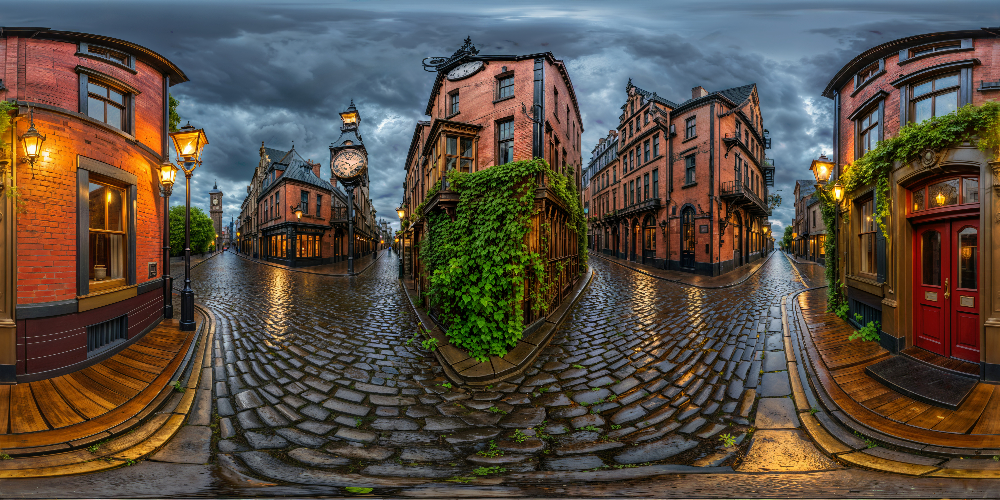
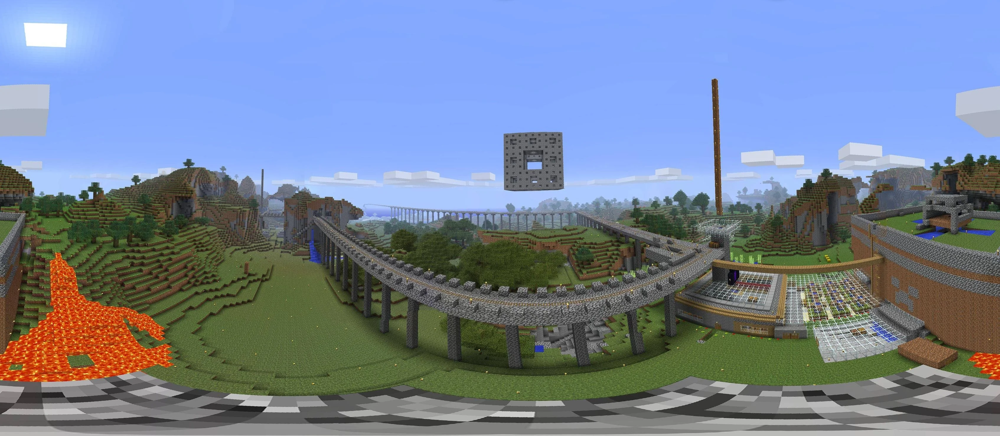
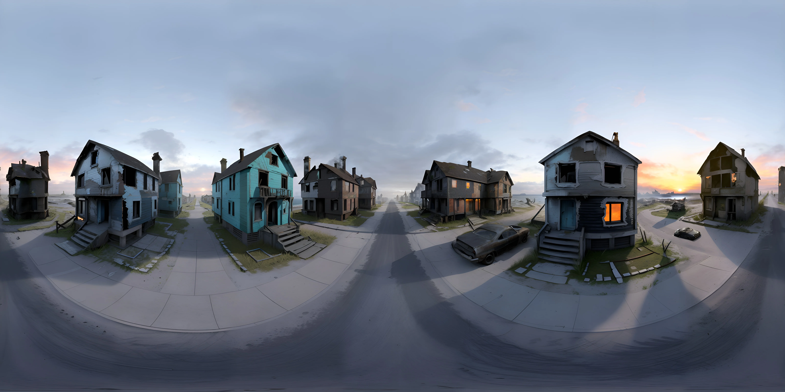
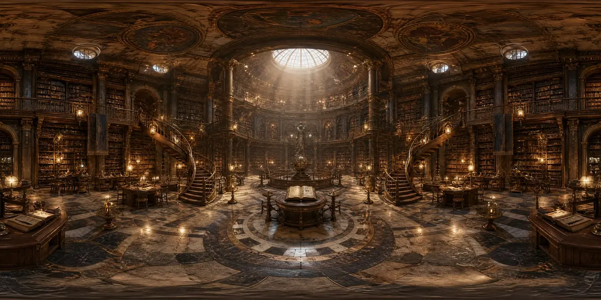

# panorama

https://pannellum.org/

#### Fantasy
  
  
  

#### Nature

#### Game

   
#### Minecraft
   
#### Street
 
#### Future city
 
#### Desert
 
#### Lampions
 
#### Lazure
 
#### Machu Pichu
 
#### Library
 
#### Public
 

---
### Links
- https://panopulse.com/
- https://www.archivinci.com/
- https://panoramagenerator.com/
