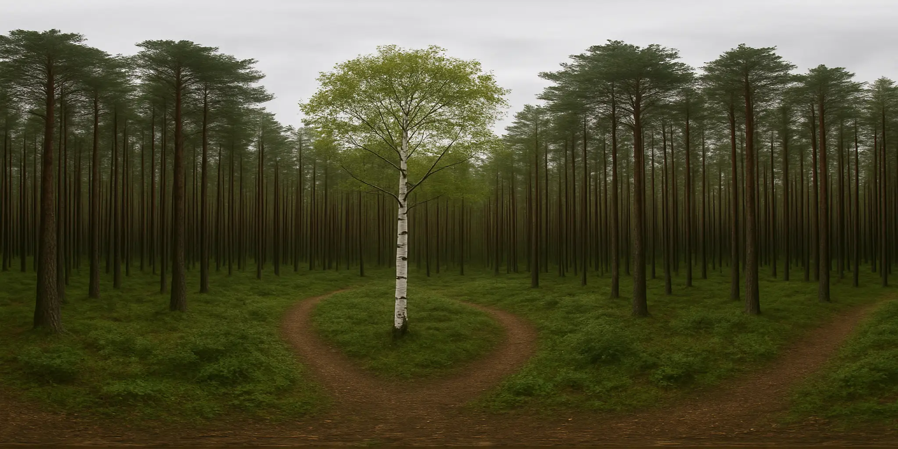
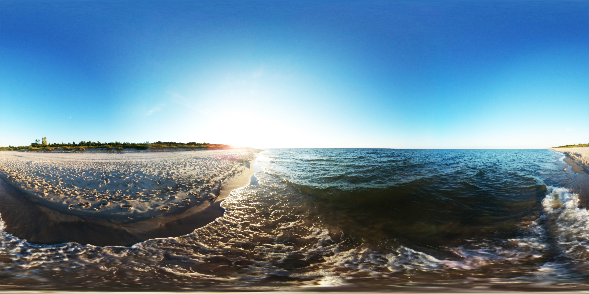
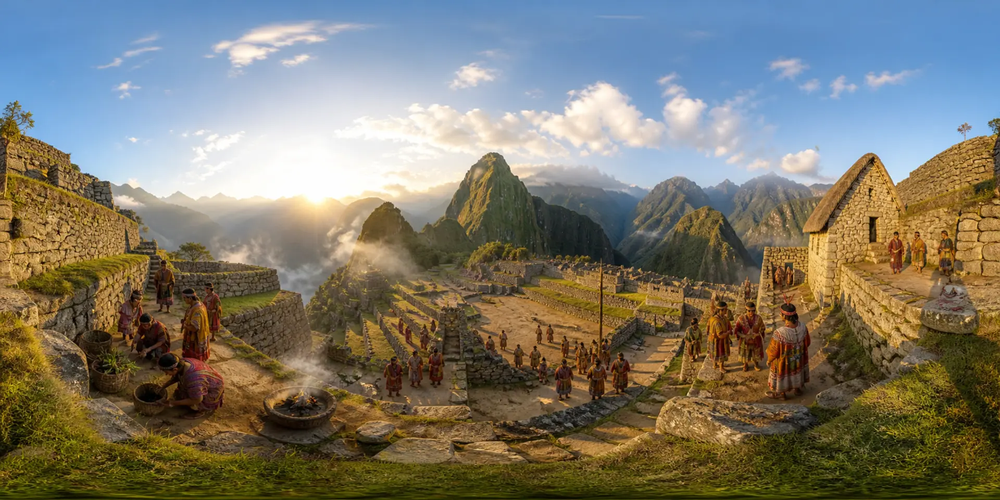
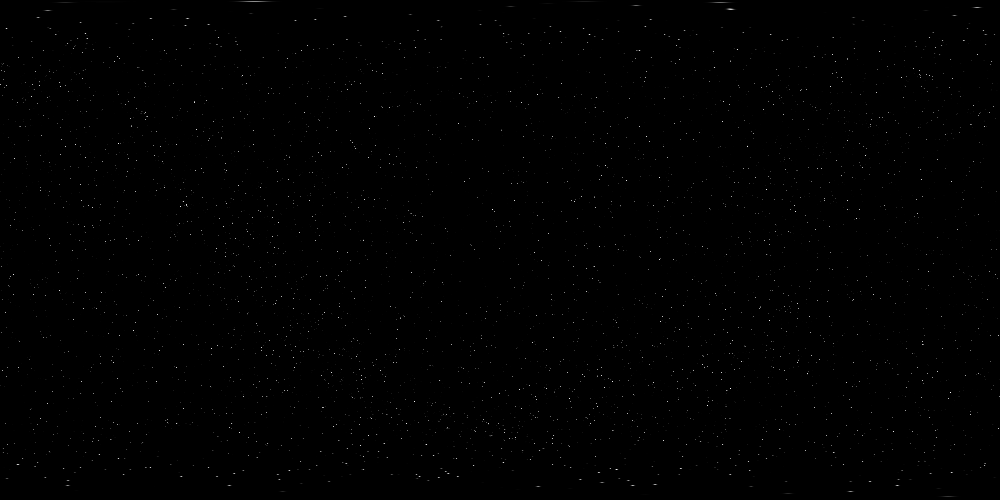
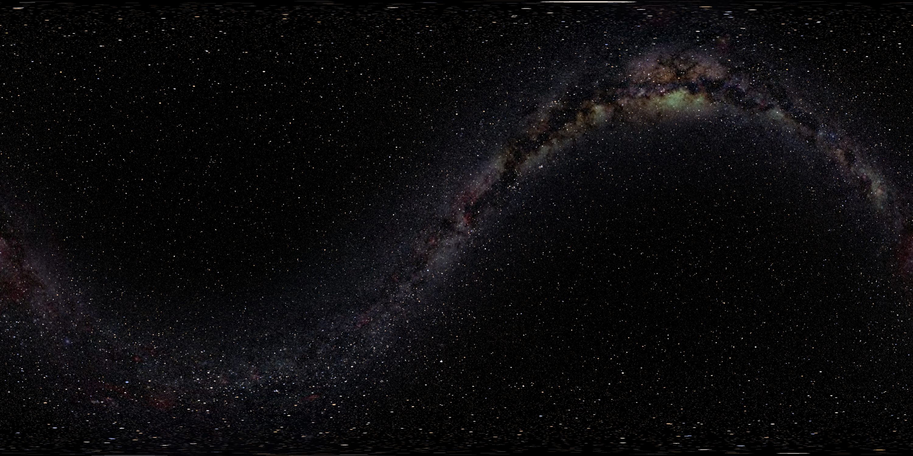
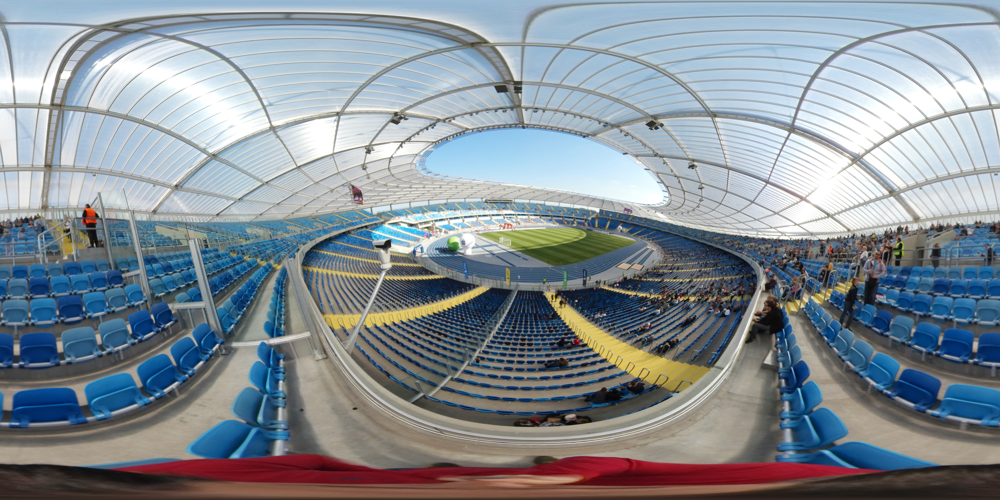

# panorama

https://pannellum.org/

#### Fantasy

  
  
  

#### Nature

#### Game

#### Heritage

#### Space

  
  
  
  

#### Casual

  
  

#### Interior

  

---
### Links
- https://panopulse.com/
- https://www.archivinci.com/
- https://panoramagenerator.com/

https://github.com/SHOWVR/panorama/blob/main/Fantasy/cityscape4.png
